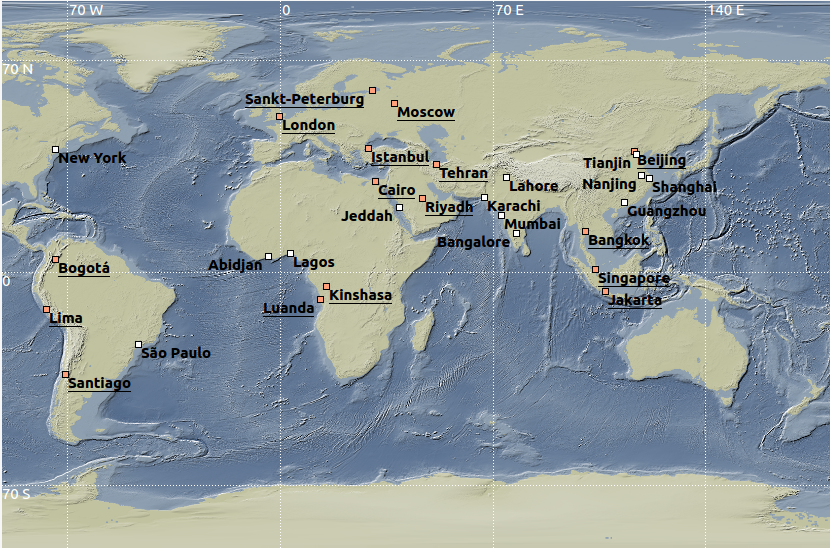
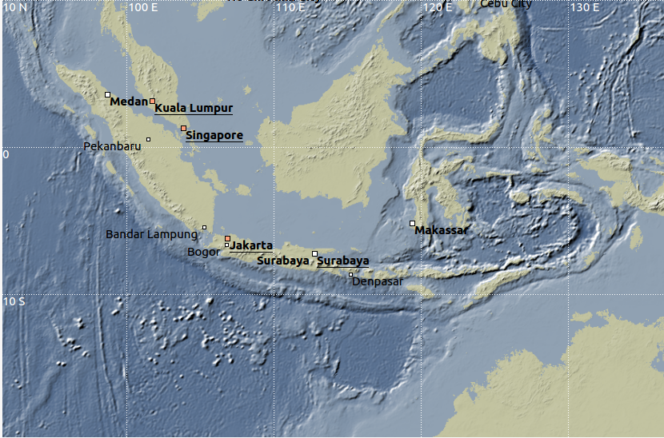
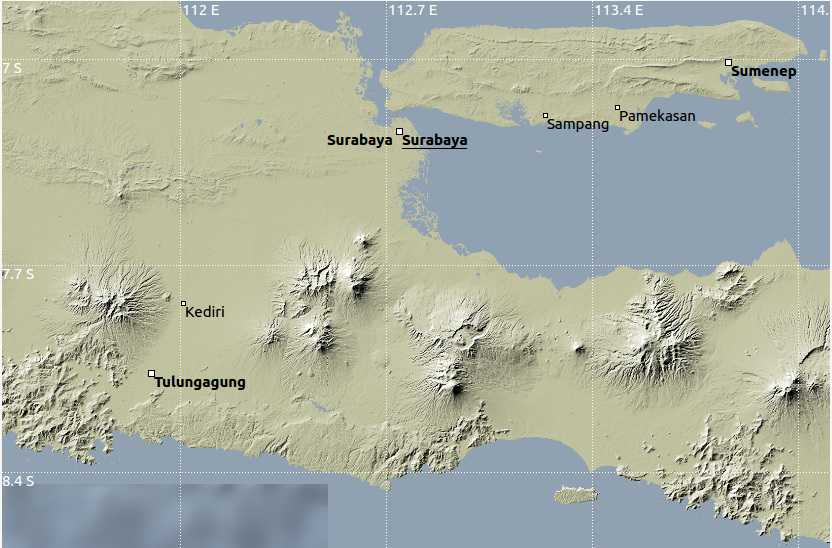
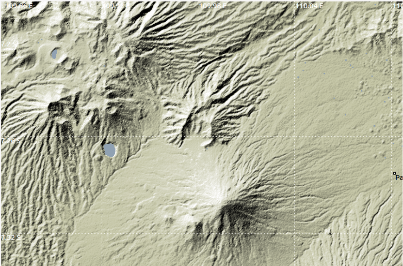

# seiscomp3 background maps

This project proposes new maps for background navigation in [SeisComP](https://www.seiscomp3.org/) applications like scolv. Improvements from basic SeisComP3 map package are:
* better global resolution using full scale ETOPO1 data
* possibility to zoom on specific targets at higher resolution, using SRTM data
* possibility to change a lot of mapping parameters (land/sea colormap, lighting, contrast, etc...)


Example of level 0 zoom (ETOPO1 data).


Example of level 3 zoom (ETOPO1 data, 1.8km resolution).


Example of level 5 zoom (SRTM3 data, 90m resolution).


Example of level 8 zoom (SRTM1 data, 30m resolution).

## seiscomp3-ipgp-maps.tgz: ready-to-use images

Download the file at [seiscomp3-ipgp-maps.tgz](http://www.ipgp.fr/~beaudu/download/seiscomp3-ipgp-maps.tgz)  (452 Mb).

This tar archive contains 355 tiles named to be used as background maps in SeisComP3.

To install it, just do (seiscomp must be installed and configured):
```sh
cd $SEISCOMP_ROOT/share/maps
tar zxf seiscomp3-ipgp-maps.tgz
```

## mksc3maps.m: make new background maps

Matlab source code to produce the maps.

### Dependencies

* some functions from [mapping-matlab](https://github.com/IPGP/mapping-matlab) toolbox are necessary, in particular [readhgt](https://github.com/IPGP/mapping-matlab/tree/master/readhgt), [dem](https://github.com/IPGP/mapping-matlab/tree/master/dem) and [ibil](https://github.com/IPGP/mapping-matlab/tree/master/ibil)
* ETOPO1 data, available at NGDC/NOAA: download the file [etopo1_bed_g_i2.zip](https://www.ngdc.noaa.gov/mgg/global/relief/ETOPO1/data/bedrock/grid_registered/binary/etopo1_bed_g_i2.zip)
* SRTM3 and SRTM1 data will be automatically downloaded by the code (needs internet connection)

### Installation and configuration

Downloads codes and data and place it in a directory.

The code is a single function without argument. Some variable must be ajusted to proper local values, editing the source mksc3maps.m:
```matlab
X.etopo = 'data/etopo1_bed_g_i2'; % ETOPO1 base filename (.bin and .hdr) 
X.psrtm3 = 'data/SRTM3'; % directory to write SRTM3 downloaded files
X.psrtm1 = 'data/SRTM1'; % directory to write SRTM1 downloaded files
```
It is mandatory to have two separated directories for SRTM1 and SRTM3 since they use the same filename. Once .hgt files are written, they won't be downloaded again from internet if the code is run again.

Default behavior of the code will make only level 4 zoom tiles using ETOPO1.

To make level 5 to 8 zoom tiles, define targets with coordinates longitude,latitude, e.g.:
```matlab
targets = [110.4486, -7.5367;  % Merapi, Indonesia
           -61.6636, 16.0444;  % Soufrière, Guadeloupe
           -61.1685, 14.8113;  % Mt. Pelée, Martinique
            55.7141,-21.2486;  % Piton de la Fournaise, Réunion
];
```
Note that targets cannot be outside latitude 60S-60N (no SRTM data).

Graphic options can be changed by editing the code script:
```matlab
seacolor = [linspace(51,144)',linspace(79,161)',linspace(122,178)']/255;
landcolor = [linspace(193,230)',linspace(194,230)',linspace(159,230)']/255;
```
Those two variables are 100x3 matrix of RGB values to define submarine and land colormaps, respectively. These colormaps attempt to reproduce the original SeisComP3 colors. Comment these lines and use seacolor.m and landcolor.m from [mapping-matlab](https://github.com/IPGP/mapping-matlab) toolbox to try colorful maps, or use any other colormap your want.

```matlab
X.optdem = {'noplot','latlon','zlim',[-1e4,1e4],'landcolor',landcolor,'seacolor',seacolor,'lake','interp'};
```
This cell vector contain options for the main dem.m function that produces the lighting relief.
* 'noplot' is to avoid figure plot of each maps on the screen during the process;
* 'latlon' is mandatory to get correct z-ratio lighting;
* 'zlim' fixes the limits (min and max in meter) of colormap, must be set to avoid color discrepencies between tiles;
* 'landcolor' sets the colormap to use for land (z > 0);
* 'seacolor' sets the colormap to use for sea (z <= 0);
* 'lake' fills any flat areas with sea color, despite the elevation value (see level 8 zoom screenshot for example);
* 'interp' interpolates gaps (no values) in the data (useful for SRTM in some high relief areas)

Lighting options are default (45°W direction, linear contrast). See [dem.m](https://github.com/IPGP/mapping-matlab/blob/master/dem/dem.m) documentation to change them and for possible additional arguments.


### Usage

From Matlab command window, run:
```matlab
mksc3maps
```
will produce all world*.png images in the current directory maps/. Images are created only if not already exist. To rebuild any image, just delete it before running the script.

Image files have to be copied to $SEISCOMP_ROOT/share/maps/ to take effect in SeisComP3.

## Authors
**François Beauducel**, IRD/IPGP, [beaudu](https://github.com/beaudu), beauducel@ipgp.fr 

**Ali A. Fahmi**, IRD

## Documentation
Type "doc mksc3maps" or see the code mksc3maps.m for details.

[SeisComP3 background maps](https://www.seiscomp3.org/wiki/recipes/backgroundmaps), _SeisComP3 documentation_
